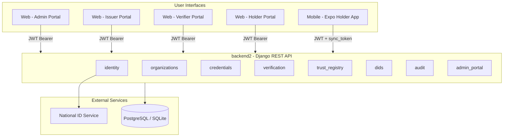
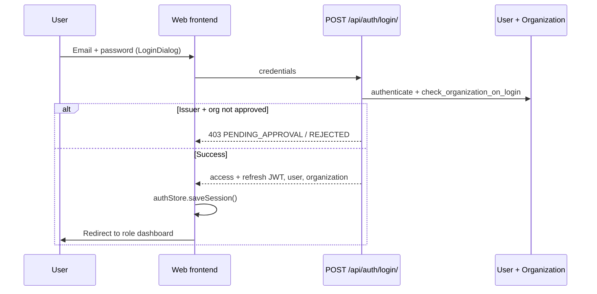
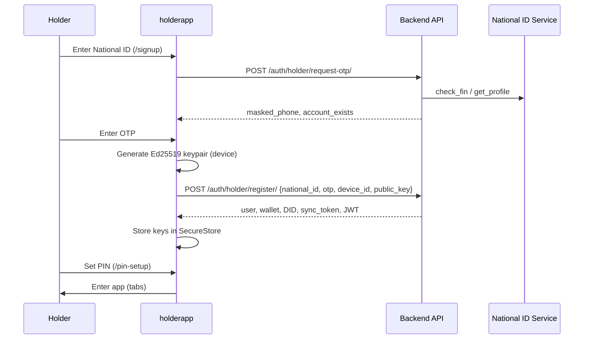
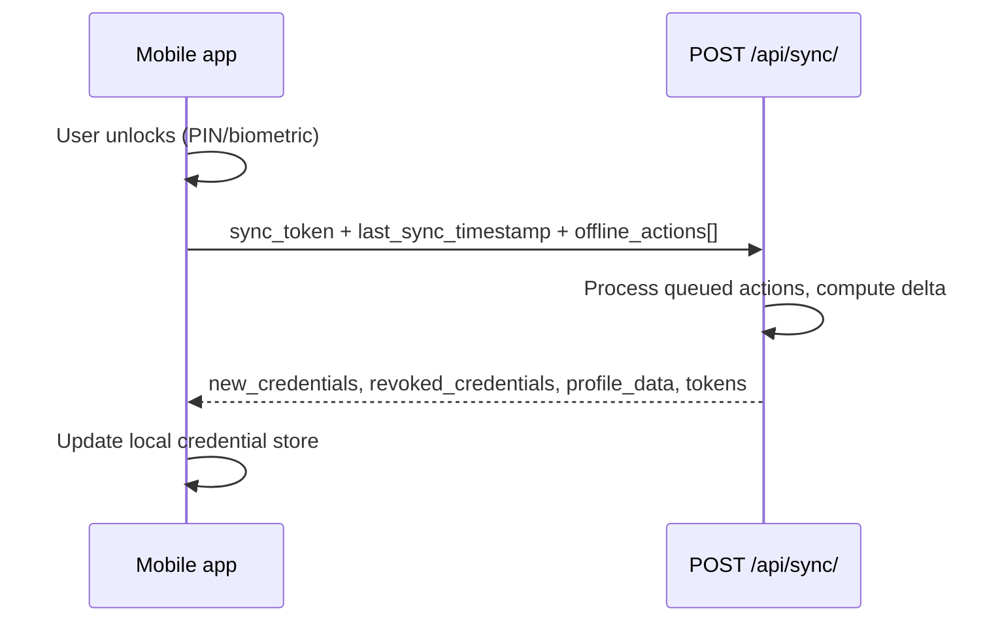
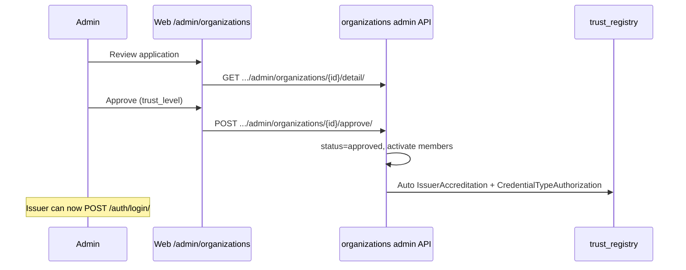
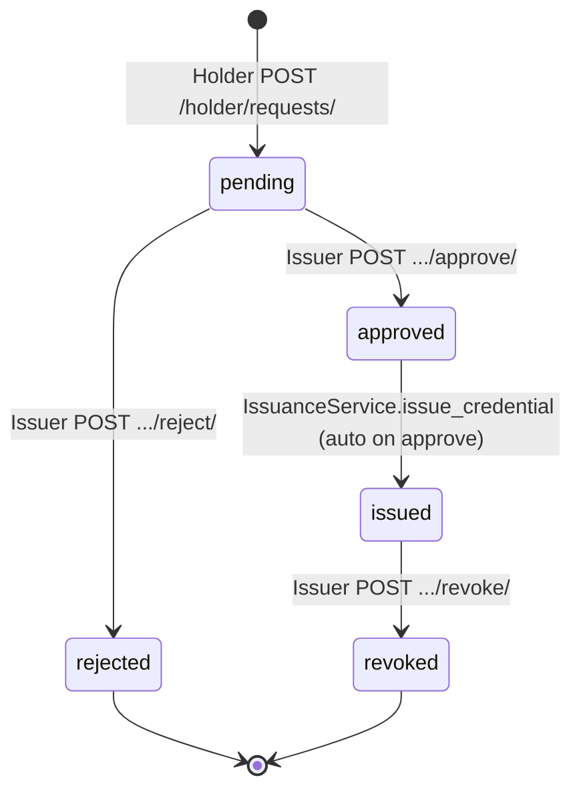
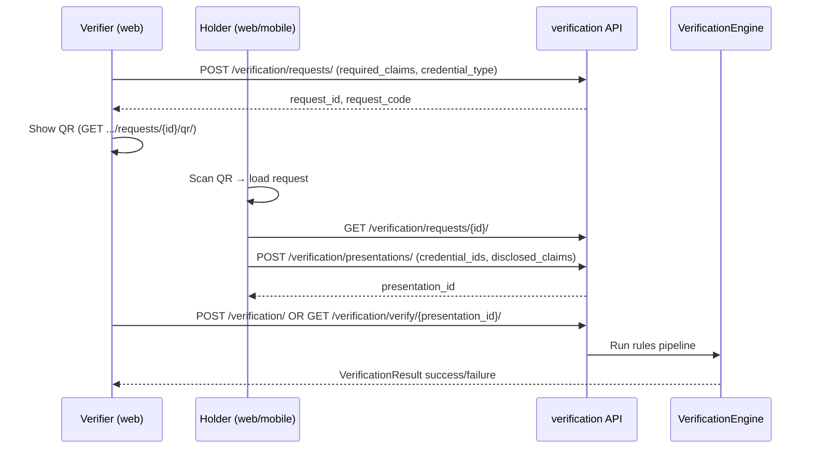
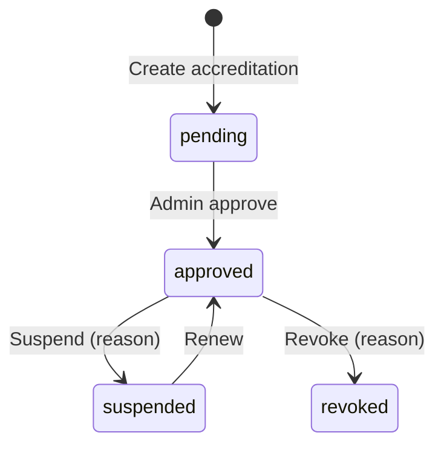
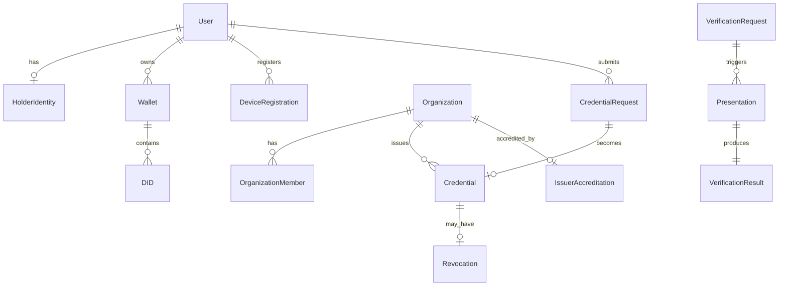

# Digital Credential Wallet — Complete Project Flows

> **Master reference document** — end-to-end flows for backend, web frontend, and mobile holder app.  
> **API base URL (dev):** `http://localhost:8000/api`  
> **Web app (dev):** `http://localhost:5173`  
> **Last updated:** May 2026

---

## Table of Contents

1. [System at a Glance](#1-system-at-a-glance)
2. [Repository Structure](#2-repository-structure)
3. [Technology Stack](#3-technology-stack)
4. [Actors and Clients](#4-actors-and-clients)
5. [Authentication Flows](#5-authentication-flows)
6. [Organization Registration Flow](#6-organization-registration-flow)
7. [Credential Lifecycle Flow](#7-credential-lifecycle-flow)
8. [Verification Flow](#8-verification-flow)
9. [Trust Registry Flow](#9-trust-registry-flow)
10. [Admin Portal Flow](#10-admin-portal-flow)
11. [Web Frontend — Routes and Journeys](#11-web-frontend--routes-and-journeys)
12. [Mobile Holder App — Routes and Journeys](#12-mobile-holder-app--routes-and-journeys)
13. [Complete API Endpoint Index](#13-complete-api-endpoint-index)
14. [Database Models Map](#14-database-models-map)
15. [Key Source Files Index](#15-key-source-files-index)
16. [Environment and Run Guide](#16-environment-and-run-guide)
17. [End-to-End Scenario Walkthroughs](#17-end-to-end-scenario-walkthroughs)

---

## 1. System at a Glance

The **Digital Credential Wallet** is a W3C-aligned verifiable credentials platform. Four roles interact through APIs and role-specific UIs:

| Role | Who | Client | Primary identifier |
|------|-----|--------|-------------------|
| **Admin** | Platform operator | Web (`frontend`) | Email + password |
| **Issuer** | University, employer, agency | Web | Email + password + organization |
| **Verifier** | Employer, border control, bank | Web | Email + password + organization |
| **Holder** | Citizen / student / employee | Web **or** Mobile (`holderapp`) | National ID + OTP (+ device keys on mobile) |

### High-level architecture



### Canonical business flows (summary)

| # | Flow | Trigger | Result |
|---|------|---------|--------|
| A | Holder onboarding | National ID + OTP | Wallet, DID, device registration, JWT |
| B | Issuer/Verifier onboarding | 6-step web registration | Org `submitted` → admin approves → can login |
| C | Credential request → issue | Holder requests → issuer approves | Signed JWT VC in holder wallet |
| D | Verification | Verifier creates request → holder presents → verifier verifies | `VerificationResult` success/failure |
| E | Revocation | Issuer revokes credential | Status list + DB updated; verification fails |

---

## 2. Repository Structure

```
DigitalCredentialWallet/
├── backend2/                 # Django REST API (main backend)
│   ├── digital_wallet/       # Project settings, root urls.py
│   ├── identity/             # Users, auth, wallets, DIDs, sync, NID
│   ├── organizations/        # Org registration, issuer/verifier profiles
│   ├── credentials/          # Issuance, requests, templates, sharing
│   ├── verification/         # Requests, presentations, verify engine
│   ├── trust_registry/       # Issuer accreditation, type authorization
│   ├── dids/                 # DID registry
│   ├── audit/                # Audit logs
│   ├── admin_portal/         # Admin-specific APIs
│   ├── common/               # Shared JWT/credential utilities
│   └── tests/
├── frontend/                 # Unified React web app (Vite + TypeScript)
│   └── src/
│       ├── app/              # App.tsx, providers
│       ├── core/             # API client, auth, routing guards
│       ├── modules/          # admin, issuer, verifier, holder, auth
│       ├── pages/            # Route-level pages per role
│       └── shared/           # UI kit, layouts, landing
├── holderapp/                # Expo React Native holder wallet
│   └── app/                  # File-based routes (Expo Router)
├── test_integration/         # Mock NID Django service (local dev)
├── docs/                     # Documentation (this file lives here)
└── readme.md                 # Project overview
```

---

## 3. Technology Stack

| Layer | Technology |
|-------|------------|
| Backend | Django 4.2, DRF, SimpleJWT, drf-spectacular, django-cors-headers |
| Database | SQLite (dev), PostgreSQL (prod) |
| Web | React 18, TypeScript, Vite, Tailwind, Radix UI, TanStack Query, Zustand, Axios |
| Mobile | Expo 54, React Native, Expo Router, Zustand, did-jwt, tweetnacl |
| Standards | W3C VC JWT, DIDs, Bitstring status lists, OID4VCI metadata, selective disclosure |

---

## 4. Actors and Clients

### 4.1 What each actor does

**Admin**
- Approves/rejects issuer and verifier organizations
- Manages users, audit logs, platform settings, trust registry
- Views reports and platform statistics

**Issuer**
- Defines credential types and templates
- Reviews holder credential requests
- Issues and revokes credentials
- Views issuance analytics

**Verifier**
- Creates verification requests (QR)
- Verifies holder presentations
- Views verification history and analytics
- Manages API keys for programmatic verify

**Holder**
- Registers with National ID
- Stores credentials in wallet (local on mobile)
- Requests new credentials from issuers
- Presents credentials to verifiers (QR / link)
- Tracks verification history

### 4.2 Which app each actor uses

| Actor | Web (`frontend`) | Mobile (`holderapp`) |
|-------|------------------|----------------------|
| Admin | ✅ `/admin/*` | ❌ |
| Issuer | ✅ `/issuer/*` | ❌ |
| Verifier | ✅ `/verifier/*` | ❌ |
| Holder | ✅ `/holder/*` | ✅ Primary experience |

---

## 5. Authentication Flows

### 5.1 Corporate login (Admin / Issuer / Verifier)



| Step | Layer | Detail |
|------|-------|--------|
| 1 | UI | `HomePage` → `LoginDialog` or `/?openLogin=true` |
| 2 | Service | `authService.login()` → `POST /api/auth/login/` |
| 3 | Backend | `identity/views/auth.py` → `login_view` |
| 4 | Check | Issuers blocked if `Organization.status != approved` |
| 5 | Storage | JWT in `localStorage` (`authToken`, `refreshToken`, `user`) |
| 6 | Redirect | admin→`/admin/dashboard`, issuer→`/issuer/dashboard`, verifier→`/verifier/dashboard` |

**Related endpoints:**
- `POST /api/auth/logout/` — blacklist refresh token
- `POST /api/token/refresh/` — refresh access token
- `POST /api/auth/forgot-password/` — reset code to cache/email
- `POST /api/auth/reset-password/` — set new password
- `POST /api/auth/change-password/` — logged-in password change
- `GET /api/users/profile/` — current user profile

---

### 5.2 Holder registration — Mobile (primary)



| Step | Endpoint | Backend service | Models created/updated |
|------|----------|-----------------|------------------------|
| 1 | `POST /api/auth/holder/request-otp/` | `HolderService.request_otp` | `OTPCode`; may refresh `HolderIdentity` from NID |
| 2 | `POST /api/auth/holder/register/` | `HolderService.register_holder` | `User`, `HolderIdentity`, `Wallet`, `DID`, `DIDKey`, `DeviceRegistration` |
| 3 | Local | PIN setup (`/pin-setup`) | Local only — `expo-local-authentication` |
| 4 | Ongoing | `POST /api/sync/` | `SyncService` — delta credentials, profile |

**Recovery (existing account, new device):**
- Same OTP flow; must supply matching `phone_number`
- Returns `is_recovery: true`; links new device

**Device re-auth (returning user):**
- `POST /api/auth/device/` — Ed25519 signature on challenge
- Returns new JWT + rotated `sync_token`

---

### 5.3 Holder registration — Web

| Step | UI | Endpoint |
|------|-----|----------|
| 1 | `HolderRegistrationDialog` on home | `POST /api/auth/holder/request-otp/` |
| 2 | OTP + email/password | `POST /api/auth/holder/web/register/` |
| 3 | Success | Redirect `/holder/dashboard` |

Web holders use **email + password** in addition to National ID verification.

---

### 5.4 National ID standalone API

Used by registration flows and optionally for profile bootstrap:

| Endpoint | Purpose |
|----------|---------|
| `POST /api/nid/initiate/` | Start NID check, send OTP |
| `POST /api/nid/verify/` | Verify OTP with NID service |
| `GET /api/nid/get-profile/?fin=` | Fetch profile; may auto-create User/Identity/Wallet |

**External URL:** `NID_SERVICE_URL` (default `http://localhost:8001/nid`) — mock in `test_integration/`.

---

### 5.5 Mobile sync (offline-first)



| Field | Purpose |
|-------|---------|
| `sync_token` | Hashed on `User`; authenticates sync without full login |
| `offline_actions` | Queued `profile_update`, `credential_request`, etc. |
| `updates.new_credentials` | Credentials issued while holder was offline |

---

## 6. Organization Registration Flow

**Who:** New Issuer or Verifier organizations (web only)  
**Prefix:** `/api/organizations/`

### 6.1 Six-step registration wizard

| Step | Web route | API endpoint | What happens |
|------|-----------|--------------|--------------|
| 0 (opt) | Registration wizard | `POST .../register/request-email-verification/` | Email OTP sent |
| 0b | | `POST .../register/verify-email/` | Email verified |
| 1 | `/auth/issuer-register` or `/auth/verifier-register` | `POST .../register/account-creation/` | `User` created (issuer/verifier role), JWT returned |
| 2 | Organization details step | `POST .../register/organization-details/` | `Organization` draft, org DID/keypair, `OrganizationMember` |
| 3 | Use case step | `POST .../register/use-case/` | Use case description saved |
| 4 | Authorization step | `POST .../register/authorization/` | Representative authorization flag |
| 5 | Documents step | `POST .../register/upload-document/` | `RegistrationDocument` files (required for issuers) |
| 6 | Review & submit | `POST .../register/submit-application/` | `status=submitted`, admin notified |
| Poll | `/auth/registration-status/:organizationId` | `GET .../register/status/{organizationId}/` | pending / approved / rejected |

**Landing pages:** `/auth/issuer-landing`, `/auth/verifier-landing`  
**Org types list:** `GET /api/organizations/register/types/`

### 6.2 Admin approval (unblocks issuer login)



**Approval side effects (`approve_organization`):**
1. `Organization.status = approved`, `is_active = True`
2. API client credentials generated
3. `IssuerAccreditation` created (issuers)
4. All `OrganizationMember` → `can_act=True`, user `organization_id` set
5. `RegistrationAuditLog` + email notification

**Reject:** `POST .../admin/organizations/{id}/reject/` with reason  
**Suspend / reactivate:** respective POST endpoints

> **Important:** Issuers **cannot log in** until organization is `approved`. Verifiers are not blocked at login for pending status.

---

## 7. Credential Lifecycle Flow

**Prefix:** `/api/` (credentials routes)

### 7.1 Full lifecycle diagram



### 7.2 Step-by-step

#### Step 1 — Holder discovers issuers and requests credential

| Item | Detail |
|------|--------|
| **Web UI** | `/holder/request-credential` → `RequestCredentialPage` |
| **Mobile** | Credentials tab → request flow |
| **Catalog** | `GET /api/holder/request-catalog/` |
| **Create request** | `POST /api/holder/requests/` |
| **Service** | `RequestService.create_credential_request` |
| **Models** | `CredentialRequest` (status=`pending`), `CredentialType`, `CredentialSchema` |
| **Outcome** | **201** `{ request_id, status: "pending" }` |

#### Step 2 — Issuer reviews requests

| Item | Detail |
|------|--------|
| **Web UI** | `/issuer/requests` → `IssuerRequestsPage` |
| **List** | `GET /api/issuer/requests/` |
| **Detail** | `GET /api/issuer/requests/{id}/` |
| **Reject** | `POST /api/issuer/requests/{id}/reject/` → status `rejected` |
| **Approve** | `POST /api/issuer/requests/{id}/approve/` → auto-issues credential |

#### Step 3 — Issuance (on approve or direct issue)

| Path | Endpoint | Service |
|------|----------|---------|
| From approved request | (inside `approve_request`) | `IssuanceService.issue_credential` |
| Direct / template | `POST /api/issuer/credentials/issue/` | `IssuanceService.issue_credential` |
| Template-based | `POST /api/issuer/templates/{id}/issue/` | Template issuance views |
| Bulk | `POST /api/issuer/templates/{id}/bulk-issue/` | After `bulk-validate` |

**Issuance internals:**
1. `assert_issuer_may_issue` — trust registry check
2. Merge claims from `HolderIdentity` + request data
3. Sign JWT verifiable credential with org keys
4. Create `Credential`, `CredentialClaimValue`
5. Add entry to W3C `StatusList` (revocation infrastructure)
6. Audit log entry

#### Step 4 — Holder receives and views credential

| Client | Endpoint | UI |
|--------|----------|-----|
| Web | `GET /api/holder/my-credentials/` | `/holder/credentials` |
| Web detail | `GET /api/holder/my-credentials/{id}/` | `/holder/credentials/:credentialId` |
| Mobile | Same + sync delta | `/(tabs)/credentials` |
| Display | `GET /api/display/{id}/` | Human-readable (no raw JWT) |
| Download | `GET /api/download/{id}/` | PDF/file export |

#### Step 5 — Revocation

| Item | Detail |
|------|--------|
| **Web UI** | Issuer credentials / issuance pages |
| **Endpoint** | `POST /api/issuer/credentials/{id}/revoke/` |
| **Service** | `RevocationService.revoke_credential` |
| **Models** | `Revocation` row + `Credential.status = revoked` |
| **Effect** | Future verifications fail `RevocationCheckRule` |

### 7.3 Credential sharing (public, no auth)

| Endpoint | Purpose |
|----------|---------|
| `GET /api/share/{share_token}/` | View shared credential |
| `GET /api/share/{share_token}/verify/` | Verify shared credential |
| `GET /api/share/{share_token}/qr/` | QR for share link |
| `POST /api/share/scan/` | Scan QR payload |

**Holder-managed sharing:**
- `POST /api/holder/sharing/enable/`
- `POST /api/holder/sharing/disable/`
- `GET /api/holder/sharing/link/`

---

## 8. Verification Flow

**Prefix:** `/api/verification/`

### 8.1 Standard flow: Verifier-initiated



### 8.2 Verification engine rules (order)

| Rule | Name | Checks |
|------|------|--------|
| 1 | `DIDValidationRule` | VC issuer DID matches `organization.organization_did` |
| 2 | `SignatureVerificationRule` | JWT signature vs org public key |
| 3 | `ExpiryCheckRule` | Credential not expired |
| 4 | `RevocationCheckRule` | Not in `Revocation` table / status list |
| 5 | `IssuerStatusRule` | Org active + `IssuerAccreditation` valid |
| 6 | `VerifierAuthorizationRule` | Verifier membership (skipped for public verify) |

**Result stored in:** `VerificationResult` (OneToOne with `Presentation`)

### 8.3 Holder-initiated presentation

| Actor | Endpoint | UI |
|-------|----------|-----|
| Holder | `POST /api/verification/holder/generate/` | Web holder detail / mobile home share |
| Verifier | `POST /api/verification/verifier/scan/` | Verifier scans holder QR |
| Public | `GET /api/verification/verify/{presentation_id}/` | `/verify/p/:presentationId` (no login) |

### 8.4 Verifier portal verification UI map

| User action | Web route | API |
|-------------|-----------|-----|
| Dashboard stats | `/verifier/dashboard` | `GET /verification/analytics/summary/` |
| Create request + QR | `/verifier/verify` | `POST /verification/requests/`, `GET .../qr/` |
| Verify presentation | `/verifier/verify` | `GET /verification/verify/{id}/` |
| History list | `/verifier/history` | `GET /verification/results/` |
| History detail | `/verifier/history/:resultId` | `GET /verification/results/{id}/` |
| Analytics | `/verifier/analytics` | `GET /verification/analytics/trends/` |
| API keys | `/verifier/settings` | `/verification/verifier/api-keys/` CRUD |

### 8.5 Bulk verification

| Endpoint | Purpose |
|----------|---------|
| `POST /api/verification/bulk/` | Start bulk job |
| `GET /api/verification/bulk/{job_id}/` | Job status |
| `GET /api/verification/bulk/{job_id}/results/` | Job results |

---

## 9. Trust Registry Flow

**Prefix:** `/api/trust-registry/`

Controls **who may issue** and **which credential types** an issuer may issue. Enforced at issuance (`TRUST_REGISTRY_ENFORCE_ISSUANCE`) and during verification (`IssuerStatusRule`).

### 9.1 Lifecycle



### 9.2 Key endpoints

| Resource | Endpoints |
|----------|-----------|
| Issuer accreditations | `GET/POST /issuer-accreditations/`, `{id}/approve/`, `suspend/`, `revoke/`, `renew/` |
| Credential type auth | `GET/POST /credential-type-authorizations/`, lifecycle actions |
| Verifier authorizations | `GET/POST /verifier-authorizations/`, lifecycle actions |
| Queries | `GET /query/issuer-status/`, `can-issue/`, `accredited-issuers/`, etc. |

**Auto-created on org approval:** `IssuerAccreditation` + all active `CredentialTypeAuthorization` for issuer orgs.

---

## 10. Admin Portal Flow

**Prefix:** `/api/admin/` (plus org admin under `/api/organizations/admin/`)

### 10.1 Admin journey map

| Task | Web route | Primary API |
|------|-----------|-------------|
| Dashboard KPIs | `/admin/dashboard` | `GET /admin/dashboard/` |
| List organizations | `/admin/organizations` | `GET /organizations/admin/organizations/{pending,approved,...}-list/` |
| Review & approve | `/admin/organizations/:id/review` | `GET .../detail/`, `POST .../approve/` |
| Manage members | `/admin/organizations/:id/members` | Member CRUD |
| Org DIDs | `/admin/organizations/:id/dids` | `GET .../dids/` |
| Org trust | `/admin/organizations/:id/trust-registry` | Trust registry per org |
| User management | `/admin/users` | `GET /users/manage/`, suspend/reactivate |
| Holder search | `/admin/users` | `GET /admin/holders/search/?national_id=` |
| Audit logs | `/admin/audit` | `GET /audit-logs/logs/` |
| Reports | `/admin/reports` | `/admin/reports/overview/`, export endpoints |
| Settings | `/admin/settings` | Profile, 2FA, sessions, notifications |
| Send notification | `/admin/send-notification` | `POST /admin/user-notifications/` |

---

## 11. Web Frontend — Routes and Journeys

**Entry:** `frontend/src/main.tsx` → `App.tsx`  
**Auth:** `AuthProvider` + `ProtectedRoute` + `baseClient` (Axios)  
**Env:** `VITE_API_URL` → default `http://localhost:8000/api`

### 11.1 All routes (complete)

#### Public
| Route | Page | Notes |
|-------|------|-------|
| `/` | `HomePage` or role redirect | `?openLogin=true` opens login |
| `/verify` | `VerifyPage` | QR scanner → presentation verify |
| `/verify/p/:presentationId` | `PublicVerifyPage` | Public verification result |
| `/holder/share/:requestId` | `ShareLinkPage` | Verifier request landing for holder |
| `/unauthorized` | `UnauthorizedPage` | Wrong role |
| `/support` | `SupportPage` | Help |
| `/login` | → `/?openLogin=true` | Redirect |
| `/auth/issuer-landing` | Issuer marketing/entry | |
| `/auth/issuer-register` | 6-step issuer registration | |
| `/auth/verifier-landing` | Verifier marketing/entry | |
| `/auth/verifier-register` | 6-step verifier registration | |
| `/auth/registration-status/:organizationId` | Poll approval status | |

#### Admin (`/admin/*`)
`dashboard`, `organizations`, `organizations/:id/review`, `details`, `members`, `dids`, `trust-registry`, `users`, `audit`, `reports`, `settings`, `send-notification`, `support`

#### Issuer (`/issuer/*`)
`dashboard`, `credentials`, `credential-types`, `templates`, `issue`, `requests`, `notifications`, `settings`, `support`

#### Verifier (`/verifier/*`)
`dashboard`, `verify`, `history`, `history/:resultId`, `analytics`, `notifications`, `settings`, `support`

#### Holder (`/holder/*`)
`dashboard`, `credentials`, `request-credential`, `credentials/:credentialId`, `verification-history`, `notifications`, `settings`, `support`

### 11.2 Frontend module architecture

```
modules/
├── admin/      → Cannot import issuer/verifier/holder
├── issuer/     → Cannot import other role modules
├── verifier/
├── holder/
├── auth/       → Shared login/registration
└── (shared via src/shared/)

Each module:
  components/  hooks/  services/api/  types/  pages/  index.ts
```

### 11.3 Auth state flow (web)

1. Login → `authService.login` → JWT stored in `localStorage`
2. `baseClient` interceptor adds `Authorization: Bearer {token}`
3. On **401** → clear storage → `auth:logout` event → redirect `/?openLogin=true`
4. On **403** with `PENDING_APPROVAL` → toast (issuer org not approved)
5. Logout → `authService.logout` → hard redirect `/`

---

## 12. Mobile Holder App — Routes and Journeys

**Entry:** `holderapp/app/_layout.tsx` (navigation guard)  
**Env:** `EXPO_PUBLIC_API_BASE_URL`

### 12.1 Navigation guard logic

```
Not registered?     → /signup
No PIN set?         → /pin-setup
Not locally authed? → /local-auth
Otherwise           → /(tabs)
```

### 12.2 All routes

| Route | Screen | Purpose |
|-------|--------|---------|
| `/signup` | Registration | National ID + OTP |
| `/pin-setup` | PIN setup | Local security |
| `/local-auth` | Unlock | PIN / biometric |
| `/login` | Legacy | Mostly redirects to signup/local-auth |
| `/forgot-pin` | PIN reset | OTP-based PIN reset |
| `/(tabs)/index` | Home | Dashboard, share credential |
| `/(tabs)/credentials` | Wallet | List credentials |
| `/(tabs)/activity` | Activity | Request/verification history |
| `/(tabs)/settings` | Settings | Profile, security, logout |
| `/scan` | QR scanner | Read verifier request QR |
| `/share` | Share flow | Build presentation for verifier |
| `/modal` | Modal | Utility |

### 12.3 Mobile journey: Scan → Share → Verify

| Step | Action | API |
|------|--------|-----|
| 1 | Verifier shows QR on web | (verifier created request) |
| 2 | Holder opens `/scan`, scans QR | Parse `verificationRequestId` |
| 3 | Navigate `/share?verificationRequestId=` | `GET /verification/requests/{id}/` |
| 4 | Select credential | `GET /holder/my-credentials/` |
| 5 | Submit presentation | `POST /verification/presentations/` |
| 6 | Show QR/link to verifier | `{origin}/verify/p/{presentationId}` |
| 7 | Verifier verifies | `GET /verification/verify/{presentationId}/` |

### 12.4 Mobile offline model

| Component | Behavior |
|-----------|----------|
| Local store | Credentials cached after sync |
| `POST /sync/` | Pull new/revoked credentials, push offline actions |
| `POST /auth/device/` | Re-auth with device signature |
| Ed25519 keys | Generated on device; **never sent private key** |
| PIN/Biometric | `expo-local-authentication` — local gate only |

---

## 13. Complete API Endpoint Index

> All paths relative to `http://localhost:8000`. Prefix `/api` unless noted.

### 13.1 Root & docs

| Method | Path |
|--------|------|
| POST | `/api/token/refresh/` |
| GET | `/api/schema/`, `/api/docs/`, `/api/redoc/` |
| GET | `/.well-known/openid-configuration` |

### 13.2 Identity (`/api/`)

| Method | Path | Description |
|--------|------|-------------|
| POST | `/api/auth/login/` | Email/password login |
| POST | `/api/auth/logout/` | Logout |
| POST | `/api/auth/forgot-password/` | Request reset |
| POST | `/api/auth/reset-password/` | Reset password |
| POST | `/api/auth/change-password/` | Change password |
| POST | `/api/auth/holder/request-otp/` | Holder OTP |
| POST | `/api/auth/holder/register/` | Mobile holder register |
| POST | `/api/auth/holder/web/register/` | Web holder register |
| POST | `/api/auth/holder/check-status/` | Registration status |
| GET | `/api/auth/holder/profile/` | Holder profile |
| POST | `/api/sync/` | Mobile sync |
| POST | `/api/auth/device/` | Device auth |
| GET | `/api/auth/device/list/` | List devices |
| DELETE | `/api/auth/device/{id}/` | Remove device |
| POST | `/api/auth/device/logout-all/` | Logout all devices |
| POST | `/api/auth/mobile/register/` | DID mobile register |
| POST | `/api/auth/mobile/challenge/` | DID challenge |
| POST | `/api/auth/mobile/verify/` | DID verify |
| GET | `/api/users/profile/` | User profile |
| GET/POST | `/api/users/manage/` | Admin user list |
| GET/PATCH/DELETE | `/api/users/manage/{id}/` | Admin user detail |
| POST | `/api/admin/holders/search/` | Search holder |
| POST | `/api/admin/holders/{id}/activate/` | Activate holder |
| POST | `/api/admin/holders/{id}/deactivate/` | Deactivate |
| GET/POST | `/api/wallets/` | Wallet CRUD |
| GET/POST | `/api/wallets/create/` | Create wallet |
| GET | `/api/wallets/{id}/` | Wallet detail |
| GET | `/api/wallet/dids/` | Wallet DIDs |
| POST | `/api/nid/initiate/` | NID OTP |
| POST | `/api/nid/verify/` | NID verify |
| GET | `/api/nid/get-profile/` | NID profile |
| GET | `/api/roles/` | Role list |

### 13.3 Organizations (`/api/organizations/`)

Registration: `register/account-creation/`, `organization-details/`, `use-case/`, `authorization/`, `upload-document/`, `submit-application/`, `status/{id}/`, `types/`

Admin: `admin/organizations/pending-list/`, `approved-list/`, `{id}/detail/`, `{id}/approve/`, `{id}/reject/`, `{id}/suspend/`, `{id}/members/`, etc.

Issuer: `issuer/profile/`, `issuer/signatories/`, `issuer/settings/*`, `issuer/notifications/`

### 13.4 Credentials (`/api/`)

Holder: `holder/request-catalog/`, `holder/requests/`, `holder/my-credentials/`, `holder/sharing/*`

Issuer: `issuer/credential-types/`, `issuer/credentials/`, `issuer/requests/`, `issuer/templates/`, `issuer/templates/{id}/issue/`, `issuer/issuance/credentials/`, `issuer/stats/*`

Public: `share/{token}/`, `display/{id}/`, `download/{id}/`, `status-lists/{id}/`

OID4VCI: `credentials/oid4vci/.well-known/openid-credential-issuer`, `credential`, `jwks`

### 13.5 Verification (`/api/verification/`)

`requests/`, `presentations/`, `` (POST verify), `verify/{presentation_id}/`, `results/`, `holder/generate/`, `verifier/scan/`, `analytics/*`, `bulk/*`, `verifier/api-keys/`, `public/verify/`

### 13.6 Trust registry (`/api/trust-registry/`)

`issuer-accreditations/`, `credential-type-authorizations/`, `verifier-authorizations/`, `query/*`

### 13.7 Admin portal (`/api/admin/`)

`dashboard/`, `issuers/`, `credentials/`, `verifications/`, `users/`, `reports/*`, `profile/`, `audit-logs/`, notifications, 2FA

### 13.8 Audit (`/api/audit-logs/`)

`logs/` — system audit trail

### 13.9 DIDs (`/api/dids/`)

DID registry management

---

## 14. Database Models Map

### 14.1 Entity relationship (simplified)



### 14.2 Models by app

| App | Key models |
|-----|------------|
| **identity** | `User`, `HolderIdentity`, `Wallet`, `DID`, `DIDKey`, `OTPCode`, `DeviceRegistration` |
| **organizations** | `Organization`, `OrganizationMember`, `OrganizationType`, `RegistrationDocument`, `RegistrationAuditLog`, `OTPVerification` |
| **credentials** | `Credential`, `CredentialRequest`, `CredentialType`, `CredentialOption`, `CredentialSchema`, `Revocation`, `StatusList`, `StatusListEntry` |
| **verification** | `VerificationRequest`, `Presentation`, `PresentationCredential`, `VerificationResult`, `ApiKey` |
| **trust_registry** | `IssuerAccreditation`, `CredentialTypeAuthorization`, `VerifierAuthorization`, `AccreditationAuditLog` |
| **audit** | Audit log entries |
| **admin_portal** | `AdminNotification`, `AdminAuditLog`, `PlatformStatistics` |

### 14.3 Important status fields

| Model | Field | Values |
|-------|-------|--------|
| `User` | `role` | holder, issuer, verifier, admin |
| `User` | `user_status` | active, pending_org, suspended |
| `Organization` | `status` | draft, submitted, approved, rejected, suspended |
| `CredentialRequest` | `status` | pending, approved, rejected |
| `Credential` | `status` | active, revoked, expired |
| `VerificationResult` | `status` | success, failure |
| `IssuerAccreditation` | `status` | pending, approved, suspended, revoked |

---

## 15. Key Source Files Index

### 15.1 Backend

| Area | Files |
|------|-------|
| URL routing | `backend2/digital_wallet/urls.py` |
| Settings | `backend2/digital_wallet/settings/base.py`, `api.py`, `extra.py` |
| Auth views | `backend2/identity/views/auth.py`, `holder_views.py`, `device_views.py` |
| Auth services | `backend2/identity/services/holder_service.py`, `sync_service.py`, `device_service.py` |
| Org registration | `backend2/organizations/views/registration_views.py` |
| Org approval | `backend2/organizations/services/admin/approve.py` |
| Issuance | `backend2/credentials/services/issuer_service.py` (IssuanceService) |
| Requests | `backend2/credentials/services/request_service.py` |
| Verification engine | `backend2/verification/services/engine.py` |
| Verification orchestration | `backend2/verification/services/verification_service.py` |
| Trust checks | `backend2/credentials/services/trust_checks.py` |

### 15.2 Web frontend

| Area | Files |
|------|-------|
| Routing | `frontend/src/app/App.tsx` |
| API client | `frontend/src/core/api/baseClient.ts` |
| Auth | `frontend/src/core/auth/authService.ts`, `authStore.ts`, `useAuth.ts` |
| Route guard | `frontend/src/core/routing/ProtectedRoute.tsx` |
| Module docs | `frontend/src/modules/README.md` |
| Admin APIs | `frontend/src/modules/admin/services/api/*` |
| Issuer APIs | `frontend/src/modules/issuer/services/api/*` |
| Verifier APIs | `frontend/src/modules/verifier/services/api/*` |
| Holder APIs | `frontend/src/modules/holder/services/api/*` |

### 15.3 Mobile

| Area | Files |
|------|-------|
| Navigation guard | `holderapp/app/_layout.tsx` |
| Registration | `holderapp/app/signup.tsx` |
| Auth API | `holderapp/src/services/auth/authApi.ts` |
| Local auth | `holderapp/src/services/auth/holderAuth.ts` |
| Share flow | `holderapp/src/screens/Share/hooks/useShare.ts` |
| Scan | `holderapp/app/scan.tsx` |

---

## 16. Environment and Run Guide

### 16.1 Backend

```bash
cd DigitalCredentialWallet/backend2
python -m venv venv
# Windows: venv\Scripts\activate
pip install -r requirements.txt
python manage.py migrate
python manage.py seed_org_types
python manage.py create_test_users
python manage.py runserver
# → http://localhost:8000
# API docs → http://localhost:8000/api/docs/
```

### 16.1.1 Default test accounts (all web portals)

Run once: `python manage.py create_test_users`

| Portal | Email | Password | Route after login |
|--------|-------|----------|-------------------|
| Admin | `admin@system.com` | `admin123` | `/admin/dashboard` |
| Holder | `holder@example.com` | `password123` | `/holder/dashboard` |
| Issuer | `issuer@university.edu` | `password123` | `/issuer/dashboard` |
| Verifier | `verifier@government.gov` | `password123` | `/verifier/dashboard` |

The command also creates approved **Test University** (issuer) and **Test Government Verifier** (verifier) organizations, plus holder identity/wallet/DID for full testing.

**Mobile holder** does not use these emails — use National ID + OTP (see Section 12).

**Key environment variables:**

| Variable | Purpose |
|----------|---------|
| `SECRET_KEY` | Django secret (required in production) |
| `DJANGO_ENV` | `development` or `production` |
| `DEBUG` | False in production |
| `ALLOWED_HOSTS` | Comma-separated hosts |
| `NID_SERVICE_URL` | National ID API base |
| `API_PUBLIC_BASE_URL` | VC status list URLs in issued credentials |
| `TRUST_REGISTRY_ENFORCE_ISSUANCE` | Gate issuance on accreditation |
| `CORS_ALLOWED_ORIGINS` | Frontend origins |

### 16.2 Web frontend

```bash
cd DigitalCredentialWallet/frontend
npm install
# .env: VITE_API_URL=http://localhost:8000/api
npm run dev
# → http://localhost:5173
```

### 16.3 Mobile holder app

```bash
cd DigitalCredentialWallet/holderapp
npm install
# .env: EXPO_PUBLIC_API_BASE_URL=http://localhost:8000/api
npx expo start
```

### 16.4 Mock NID service (optional)

```bash
cd DigitalCredentialWallet/test_integration
python manage.py runserver 8001
# NID_SERVICE_URL=http://localhost:8001/nid
```

---

## 17. End-to-End Scenario Walkthroughs

### Scenario A — New holder on mobile receives a degree credential

1. Holder installs app → `/signup` → `POST /auth/holder/request-otp/` → `POST /auth/holder/register/`
2. Sets PIN → enters `/(tabs)`
3. Holder opens web or app → `POST /api/holder/requests/` to university issuer
4. Issuer logs in (org must be approved) → `/issuer/requests` → approves
5. Backend auto-issues credential → `IssuanceService.issue_credential`
6. Holder syncs → `POST /api/sync/` → `new_credentials` in response
7. Credential appears in `/(tabs)/credentials`

### Scenario B — New issuer organization joins platform

1. User visits `/auth/issuer-register` → completes steps 1–6
2. `POST .../submit-application/` → org status `submitted`
3. Admin logs in → `/admin/organizations` → reviews → `POST .../approve/`
4. Trust registry accreditation auto-created
5. Issuer logs in → `POST /auth/login/` → `/issuer/dashboard`

### Scenario C — Employer verifies employee credential

1. Verifier logs in → `/verifier/verify` → creates request → `POST /verification/requests/`
2. QR shown → `GET /verification/requests/{id}/qr/`
3. Employee (holder) scans on mobile → `/scan` → `/share`
4. `POST /verification/presentations/` with selected credential + disclosed claims
5. Verifier scans result or opens link → `GET /verification/verify/{presentation_id}/`
6. Engine runs 6 rules → `VerificationResult` stored
7. Both parties see history (verifier: `/verifier/history`, holder: `/holder/verification-history`)

### Scenario D — Issuer revokes expired license

1. Issuer → `/issuer/credentials` → select credential
2. `POST /api/issuer/credentials/{id}/revoke/`
3. `Revocation` record + status list updated
4. Next verification → `RevocationCheckRule` fails → result `failure`

### Scenario E — Public verifies shared link (no account)

1. Holder shares link (sharing enabled) or presentation URL
2. Anyone opens `/verify/p/{presentationId}`
3. `GET /api/verification/verify/{presentationId}/` (public)
4. UI shows verified claims and check results

---

## Appendix A — Related documentation

| Document | Location |
|----------|----------|
| Portal behavior (actors) | `docs/portal-flows.md` |
| API source of truth | `docs/API_SOURCE_OF_TRUTH.md` |
| SRS | `docs/SRS.md` |
| Backend README | `backend2/README.md` |
| Mobile setup | `backend2/REACT_NATIVE_SETUP.md`, `holderapp/README.md` |
| Module reports | `docs/reports/00-summary-report.md` … `04-duplicate-code-report.md` |
| Frontend modules | `frontend/src/modules/README.md` |

---

## Appendix B — Known integration notes

1. **Two holder auth models:** Mobile = National ID + device keys + sync. Web holder = National ID + email/password.
2. **Issuer login blocked** until `Organization.status == approved`.
3. **Approving a request auto-issues** — no separate issue call needed after `POST .../approve/`.
4. **README vs code:** Root `readme.md` lists older paths (`/api/users/login/`); actual login is `/api/auth/login/`.
5. **Org admin APIs** exist under both `/api/organizations/admin/` and `/api/admin/issuers/` — prefer organizations admin for full approval workflow.
6. **Presentation verify URL format:** `{WEB_ORIGIN}/verify/p/{presentationId}`.

---

*This document is the single master flow reference for the Digital Credential Wallet project. For API contract details, see `docs/API_SOURCE_OF_TRUTH.md` and live Swagger at `/api/docs/`.*
